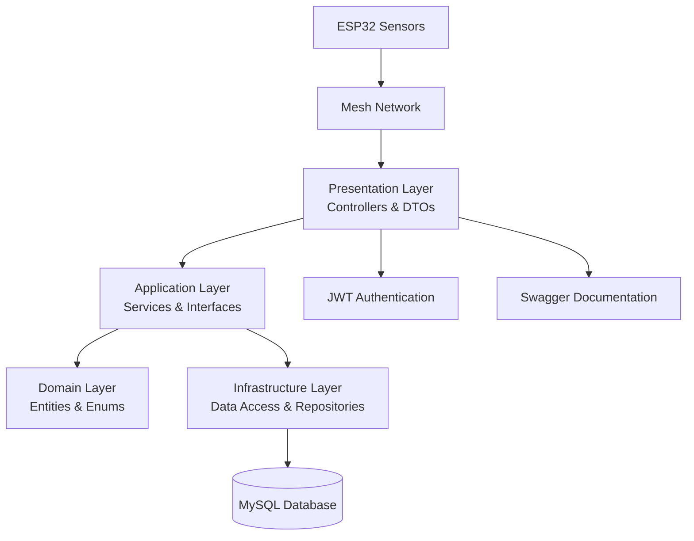

# DisasterShield - Simulador de Sensores IoT

O **DisasterShield** é um sistema de monitoramento de desastres naturais que utiliza sensores IoT para detectar enchentes, incêndios e etc. Este repositório contém o simulador de sensores (`sensor_simulator.py`) que gera dados mockados de sensores de nível de água e fumaça, enviando essas informações para a API do sistema.

## 👨‍🎓 Participantes
- Julia Brito - RM 558831
- Leandro Correia - RM 556203
- Victor Antonopoulos - RM 556313

## 🔗 LINKS IMPORTANTES

### 🔥 **CIRCUITO ELETRÔNICO COMPLETO**
**https://wokwi.com/projects/432673842933997569**

### 📊 **DASHBOARD DO PROJETO**
**https://github.com/correialeo/disaster-shield-dashboard**

### Vídeos
- [Demonstração IOT - Dashboard](https://youtu.be/WXqfdYOTrMg)
- [PITCH](https://youtu.be/8D1A1Ji5vlc)

---

## Arquitetura de Camadas



## 🚨 Sobre o Simulador

O simulador reproduz o comportamento de dois sensores críticos para detecção de desastres:

- **Sensor de Nível de Água #6**: Monitora níveis de água para detectar enchentes
- **Sensor de Fumaça #7**: Detecta concentração de fumaça para alertas de incêndio

### 🎯 Funcionalidades Principais

- **Simulação Realística**: Gera dados com ruído e variações naturais
- **Múltiplos Modos**: Normal, Alerta e Misto para diferentes cenários de teste
- **Alertas Automáticos**: Detecta situações críticas e emite alertas
- **Envio para API**: Transmite dados em tempo real para o sistema principal
- **Execução Simultânea**: Múltiplos sensores funcionam em paralelo

## 📋 Pré-requisitos

- Python 3.7 ou superior
- pip (gerenciador de pacotes do Python)
- Acesso à internet para envio de dados

## 🚀 Configuração e Execução

### 1. Clone o repositório
```bash
git clone https://github.com/correialeo/dshield-iot.git
cd dshield-iot
```

### 2. Crie o ambiente virtual
```bash
# Windows
python -m venv sensor_sim_env

# macOS/Linux
python3 -m venv sensor_sim_env
```

### 3. Ative o ambiente virtual

#### Windows:
```bash
# Command Prompt
sensor_sim_env\Scripts\activate

# PowerShell
sensor_sim_env\Scripts\Activate.ps1
```

#### macOS/Linux:
```bash
source sensor_sim_env/bin/activate
```

### 4. Instale as dependências
```bash
pip install requests
```

### 5. Execute o simulador
```bash
python sensor_simulator.py
```

## 🎛️ Modos de Simulação

O simulador oferece três modos distintos:

### 1. **Modo Normal**
- Sensor de Água: 0-100 cm (níveis seguros)
- Sensor de Fumaça: 5-200 ppm (concentrações normais)
- Ideal para testes de funcionamento básico

### 2. **Modo Alerta**
- Sensor de Água: 100-200 cm (níveis de enchente)
- Sensor de Fumaça: 200-1000 ppm (concentrações perigosas)
- Simula situações de emergência

### 3. **Modo Misto**
- 70% dos valores em faixa normal
- 30% dos valores em faixa de alerta
- Simula condições reais com ocasionais emergências

## 📊 Especificações dos Sensores

| Sensor | ID | Tipo | Intervalo | Faixa Normal | Faixa Alerta |
|--------|----|----|----------|-------------|-------------|
| Água | 6 | Nível de Água | 3s | 0-100 cm | 100-200 cm |
| Fumaça | 7 | Concentração | 2s | 5-200 ppm | 200-1000 ppm |

## 🔧 Configuração da API

Por padrão, o simulador envia dados para:
```
API_URL = "http://localhost:5046/api/DeviceData"
```

Para alterar o endpoint, edite a variável `API_URL` no arquivo `sensor_simulator.py`.

## 📈 Formato dos Dados

Os dados são enviados via POST (HTTP) em formato JSON:
```json
{
    "deviceId": 6,
    "value": 85.3
}
```

## 🔄 Controle da Simulação

- **Iniciar**: Escolha um modo e pressione Enter
- **Parar**: Pressione `Ctrl+C` a qualquer momento
- **Trocar Modo**: Pare a simulação atual e escolha um novo modo

## 🛑 Para desativar o ambiente virtual
```bash
deactivate
```

## 📚 Integração com o Sistema Completo

Este simulador é parte do ecossistema **DisasterShield**:

- **Circuito Físico**: Veja o hardware real no Wokwi
- **Dashboard**: Visualize os dados em tempo real
- **API**: Processa e armazena os dados dos sensores
- **Alertas**: Sistema de notificações para emergências

---

## 🆘 Sobre o DisasterShield

O DisasterShield é um sistema completo de monitoramento e alerta para desastres naturais, especialmente focado em:
- **Detecção de Enchentes**: Monitoramento contínuo de níveis de água
- **Alerta de Incêndios**: Detecção precoce através de sensores de fumaça
- **Resposta Rápida**: Alertas automáticos para autoridades e população

*Consulte os links importantes acima para explorar o projeto completo.*
